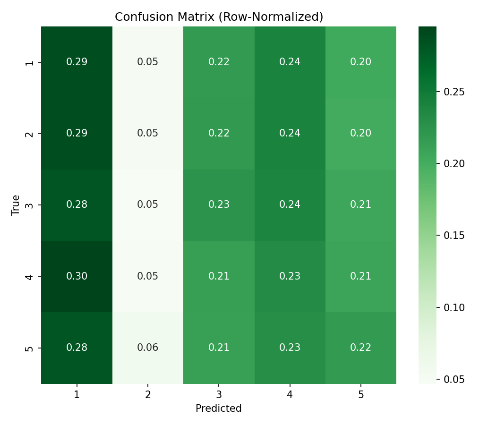

⚡ HomeGenie – AI-Powered Smart Home Energy Optimizer

HomeGenie is an ML pipeline that learns household energy usage patterns and produces predictions, accuracy/loss graphs, and confusion-matrix heatmaps. It’s built to work with smart-meter / smart-home timeseries CSVs and saves fully reusable artifacts (H5/PKL/YAML/JSON).

🎯 What’s Inside

Training (train_homegenie.py)

Auto-detects feature types (numeric, categorical, text, datetime)

Version-safe preprocessing (no lambdas; picklable)

Trains a compact Keras model (binary or multiclass)

Saves artifacts: .h5, .pkl, .json, .yaml

Exports training curves: accuracy.png, loss.png

Evaluation (evaluate_homegenie_fixed.py)

Loads artifacts + recreates the same 80/20 split

Plots and saves accuracy/loss curves, confusion matrix (counts + normalized)

Writes classification_report.txt

Prediction (predict_homegenie.py)

CLI + Jupyter-safe (strips Jupyter’s -f arg, interactive fallback)

Predict from CSV (--in) or single text (--text, if you had text features)

Saves predictions_homegenie.csv and can print a compact result table

📦 Requirements

Python 3.11+

TensorFlow/Keras

scikit-learn

pandas, numpy, scipy

matplotlib, seaborn

joblib, PyYAML

Install (e.g., with pip):

pip install tensorflow scikit-learn pandas numpy scipy matplotlib seaborn joblib pyyaml

If you’re on CPU-only TensorFlow, install tensorflow (CPU). If you have a compatible NVIDIA GPU + CUDA, install tensorflow (or the GPU build as per TF docs).

🗂️ Data & Paths

Input CSV
C:\Users\sagni\Downloads\Home Genie\archive\smart_home_energy_consumption_large.csv

Artifacts & Outputs
C:\Users\sagni\Downloads\Home Genie\

The training script auto-detects the target column. If your last column is truly the target, you’re good. If you prefer an explicit target, set target_col = "your_column" inside train_homegenie.py.

🚀 Quick Start
1) Train
python train_homegenie.py

Outputs (in C:\Users\sagni\Downloads\Home Genie\):

homegenie_model.h5

homegenie_preprocess.pkl

homegenie_model.json

homegenie_model.yaml

training_history.csv

accuracy.png, loss.png

2) Evaluate (graphs + heatmaps + report)
python evaluate_homegenie_fixed.py

Outputs:

eval_accuracy.png, eval_loss.png (if training_history.csv exists)

confusion_matrix.png (counts)

confusion_matrix_norm.png (row-normalized)

classification_report.txt (precision/recall/F1 per class)

3) Predict (CSV or single text)

From CSV

python predict_homegenie.py --in "C:\Users\sagni\Downloads\Home Genie\archive\new_data.csv" --out "C:\Users\sagni\Downloads\Home Genie\predictions_homegenie.csv" --print

Single text (useful only if you trained with text columns)

python predict_homegenie.py --text "High AC usage in the evening" --print

In Jupyter (no argparse)

from predict_homegenie import predict_csv, predict_text

predict_csv(r"C:\Users\sagni\Downloads\Home Genie\archive\new_data.csv",
            save_to=r"C:\Users\sagni\Downloads\Home Genie\predictions_homegenie.csv",
            show=True)

predict_text("Washer and dryer in off-peak hours", show=True)

Running predict_homegenie.py without args in Jupyter will prompt you to enter a sentence or a CSV path interactively.

🧠 Model & Preprocessing (Overview)

Preprocessing

Numeric: median impute → StandardScaler

Categorical: most-frequent impute → OneHotEncoder (version-safe: sparse_output or sparse)

Text: TF-IDF (max_features=5000) per text column

Datetime: expand to year/month/day/dayofweek/hour → impute → scale

Implemented with scikit-learn ColumnTransformer + custom, picklable transformers:

ColumnSelector, To1DString, DateTimeExpand

Model

Keras Sequential: Dense(128, relu) → Dropout(0.3) → Dense(64, relu) → Output

Binary → Dense(1, sigmoid), binary_crossentropy

Multiclass → Dense(n_classes, softmax), sparse_categorical_crossentropy

Metrics: accuracy

📁 Suggested Repo Structure
HomeGenie/
│── train_homegenie.py
│── evaluate_homegenie_fixed.py
│── predict_homegenie.py
│── archive/
│   └── smart_home_energy_consumption_large.csv
│── outputs/  (optional; or use C:\Users\sagni\Downloads\Home Genie)
│   ├── homegenie_model.h5
│   ├── homegenie_preprocess.pkl
│   ├── homegenie_model.json
│   ├── homegenie_model.yaml
│   ├── training_history.csv
│   ├── accuracy.png
│   ├── loss.png
│   ├── eval_accuracy.png
│   ├── eval_loss.png
│   ├── confusion_matrix.png
│   ├── confusion_matrix_norm.png
│   ├── classification_report.txt
│   └── predictions_homegenie.csv
└── README.md

🔍 Interpreting Outputs

accuracy.png / eval_accuracy.png: training vs validation accuracy across epochs

loss.png / eval_loss.png: training vs validation loss

confusion_matrix*.png: class-level performance (counts & normalized)

classification_report.txt: precision / recall / F1 per class

predictions_homegenie.csv: predicted label + per-class probabilities

🧰 Troubleshooting & Tips

AttributeError: Can't get attribute 'DateTimeExpand' … when loading PKL
Use evaluate_homegenie_fixed.py / predict_homegenie.py. They redeclare the custom classes before joblib.load(...), enabling safe unpickling.

ABSL warning: “compiled metrics have yet to be built”
We compile the loaded model in the scripts to silence this (not required for predict(), but harmless and useful).

Argparse error in Jupyter (unrecognized -f …json)
The predictor strips injected Jupyter args and even supports an interactive prompt if you run without arguments.

OneHotEncoder argument error (sparse vs sparse_output)
The training script uses a version-safe helper to pick the right parameter for your scikit-learn version.

Large CSVs / memory

Start with fewer epochs (e.g., epochs=5) to iterate.

Train on a sampled subset for quick prototyping.

Consider chunked reads or downcasting numerics.

Wrong target chosen
If the auto-detected target isn’t what you intend, set:

target_col = "your_target_column_name"

inside train_homegenie.py.

🗺️ Roadmap (Nice-to-haves)

Regression variant (predict kWh as a continuous value: MSE/MAE, RMSE plots)

Anomaly detection (e.g., IsolationForest) and spike alerts

Tariff-aware smart scheduling (cost optimization)

Simple Streamlit dashboard to visualize all outputs

If you want the regression version or a Streamlit dashboard, say the word and I’ll add the code.
Author
SAGNIK PATRA
